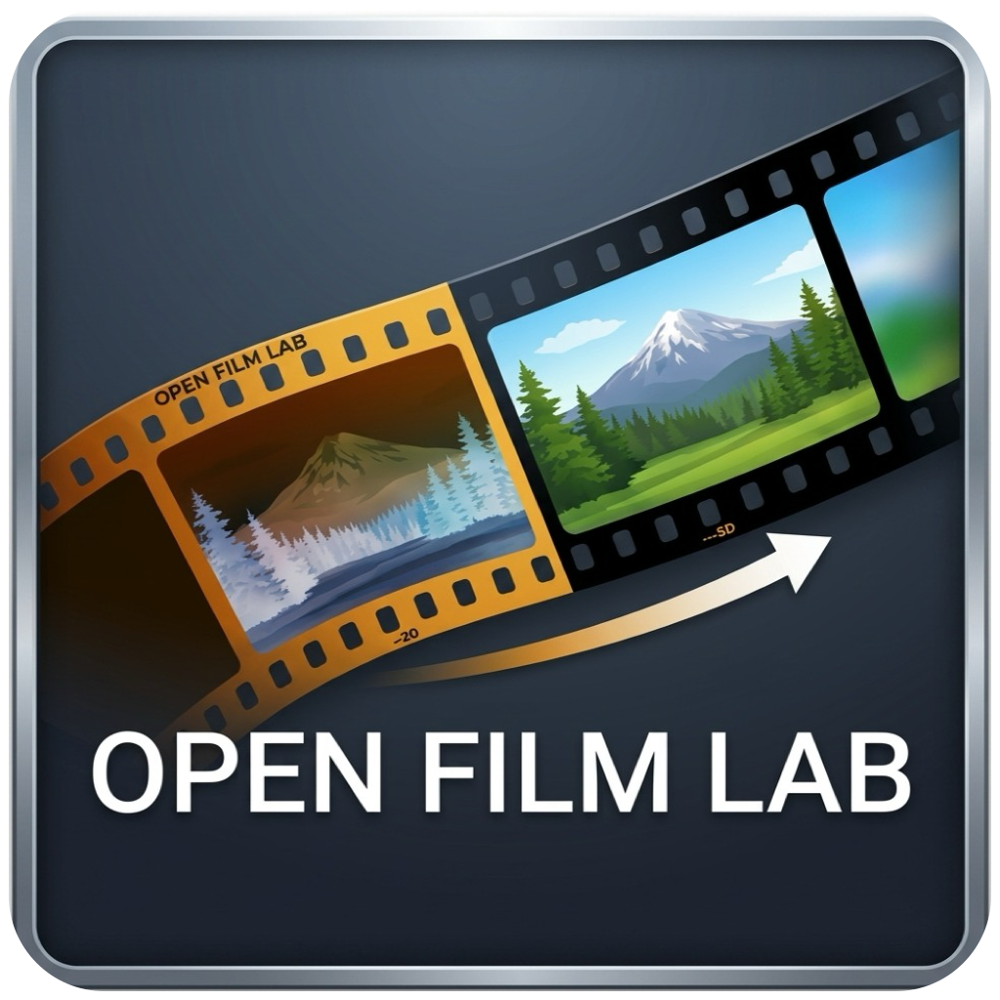

# Open Film Lab

<p align="center">
  
</p>

<p align="center">
  <strong>A high-performance, cross-platform analog film negative processor and digital darkroom for camera scans and film digitizations.</strong>
</p>

<p align="center">
  <a href="#features">Features</a> •
  <a href="#dependencies">Dependencies</a> •
  <a href="#build-instructions">Build Instructions</a> •
  <a href="#packaging--distribution">Packaging</a> •
  <a href="#quick-start-workflow">Quick Start</a> •
  <a href="#license">License</a>
</p>

---

## Overview

**Open Film Lab** is an open-source desktop application designed specifically for film photographers digitizing 35mm, 120 medium format, and 4x5 large format film using digital cameras (DSLR / mirrorless camera scanning) or dedicated flatbed/film scanners.

Converting color and black-and-white film negatives traditionally involves tedious manual curve inversions or expensive proprietary software. Open Film Lab provides an intuitive, real-time, non-destructive digital darkroom workflow built from the ground up in C11 and GTK4. It delivers instant raw demosaicing, precision film base mask sampling, accurate negative inversion, comprehensive color grading, and color-managed batch export.

---

## Features

- **Native Camera RAW & TIFF Support**
  - High-fidelity RAW demosaicing powered by **LibRaw**, supporting Canon (CR2/CR3), Nikon (NEF), Sony (ARW), Fujifilm (Bayer & X-Trans RAF), Leica (DNG), Olympus (ORF), Panasonic (RW2), Pentax (PEF), and more.
  - Full support for 8-bit and 16-bit uncompressed and compressed TIFF scanner files via **LibTIFF**.
  - High-speed embedded thumbnail extraction for instant, zero-lag filmstrip browsing across entire folders.

- **Film Negative Inversion Engine**
  - **Precision Film Base Sampling**: One-click film base mask picker with live RGB sampling HUD. Sample rebate/sprockets to neutralize orange film mask color casts instantly.
  - **Batch Base Propagation**: Apply sampled film base to all frames in the roll with a single click.
  - **Multiple Processing Modes**:
    - **Color Negative**: Automatic film mask subtraction and balance inversion.
    - **Black & White Negative**: Accurate luminance conversion and gamma curve mapping.
    - **Slide / Positive**: Direct processing for positive films and standard digital images.

- **Non-Destructive Adjustment Suite**
  - **Exposure**: ±4.0 EV with exposure compensation.
  - **Contrast**: -100 to +100 S-curve tone curve control.
  - **Temperature & Tint**: Cool/warm and green/magenta white balance adjustments.
  - **Per-Channel RGB Density**: Independent Red, Green, and Blue density controls (-100 to +100).
  - **Interactive Controls**: Double-click any slider to reset to default; direct editable numeric textboxes with real-time input validation; individual and global reset buttons.

- **Composition & Crop Tool**
  - Freeform crop overlay with draggable interactive corner and edge handles.
  - Live on-canvas resolution badge displaying exact output width and height in pixels.
  - Rule-of-thirds composition grid overlay.
  - Lossless 90° clockwise and counter-clockwise rotation.

- **Color-Managed Multi-Format Batch Export**
  - Multi-threaded asynchronous background export queue with live progress bar and cancellation.
  - Export selected frames or entire roll folders.
  - Output formats: **JPEG** (adjustable 1–100 quality) and **TIFF** (8-bit or 16-bit uncompressed).
  - **Little CMS 2 (LCMS2)** color management: Embedded ICC color profiles for **sRGB**, **Adobe RGB (1998)**, and **Display P3**.

- **Modern Cross-Platform GTK4 UI**
  - Responsive dark UI theme with client-side headerbar navigation.
  - Native window controls (minimize, maximize, close) across Linux (GNOME/KDE), macOS, and Windows.

---

## Dependencies

Open Film Lab requires the following development libraries:

| Dependency | Minimum Version | Description |
| :--- | :--- | :--- |
| **GTK4** | `>= 4.10` | GUI toolkit and widget framework |
| **LibRaw** | `>= 0.20` | RAW image demosaicing and metadata extraction |
| **LibTIFF** | `>= 4.0` | TIFF reading, processing, and writing |
| **libjpeg** | Standard / Turbo | JPEG export encoding |
| **Little CMS 2 (lcms2)** | `>= 2.0` | Color management and ICC profile transforms |
| **Meson** | `>= 0.59` | Build system configuration |
| **Ninja** | `>= 1.10` | Fast build execution engine |
| **C Compiler** | C11 compliant | `gcc` or `clang` |
| **pkg-config** | Any | Library detection |

---

## Build Instructions

### Linux

#### 1. Install Dependencies

##### Debian / Ubuntu / Linux Mint
```bash
sudo apt update
sudo apt install -y \
  meson \
  ninja-build \
  build-essential \
  pkg-config \
  libgtk-4-dev \
  libraw-dev \
  libtiff-dev \
  libjpeg-dev \
  liblcms2-dev
```

##### Fedora / RHEL
```bash
sudo dnf install -y \
  meson \
  ninja-build \
  gcc \
  pkgconf-pkg-config \
  gtk4-devel \
  LibRaw-devel \
  libtiff-devel \
  libjpeg-turbo-devel \
  lcms2-devel
```

##### Arch Linux / Manjaro
```bash
sudo pacman -S --needed \
  meson \
  ninja \
  gcc \
  pkgconf \
  gtk4 \
  libraw \
  libtiff \
  libjpeg-turbo \
  lcms2
```

#### 2. Compile and Run
```bash
# Configure the build directory
meson setup build

# Compile with Ninja
ninja -C build

# Launch Open Film Lab
./build/src/open-film-lab
```

#### 3. System-Wide Installation (Optional)
```bash
sudo ninja -C build install
```

---

### macOS

#### 1. Install Dependencies via Homebrew
Ensure you have [Homebrew](https://brew.sh/) installed, then run:

```bash
brew install \
  meson \
  ninja \
  pkg-config \
  gtk4 \
  libraw \
  libtiff \
  jpeg \
  little-cms2
```

#### 2. Compile and Run
```bash
# Configure build
meson setup build

# Compile
ninja -C build

# Launch the binary
./build/src/open-film-lab
```

---

### Windows

The recommended build environment for Windows is **MSYS2 with UCRT64**.

#### 1. Set Up MSYS2 UCRT64
1. Download and install MSYS2 from [msys2.org](https://www.msys2.org/).
2. Open the **MSYS2 UCRT64** terminal from the Start menu.
3. Update packages and install required tools and libraries:

```bash
pacman -Syu
pacman -S --needed \
  mingw-w64-ucrt-x86_64-gcc \
  mingw-w64-ucrt-x86_64-meson \
  mingw-w64-ucrt-x86_64-ninja \
  mingw-w64-ucrt-x86_64-pkgconf \
  mingw-w64-ucrt-x86_64-gtk4 \
  mingw-w64-ucrt-x86_64-libraw \
  mingw-w64-ucrt-x86_64-libtiff \
  mingw-w64-ucrt-x86_64-libjpeg-turbo \
  mingw-w64-ucrt-x86_64-lcms2 \
  mingw-w64-ucrt-x86_64-ntldd
```

#### 2. Compile and Run
In the **MSYS2 UCRT64** terminal:

```bash
# Configure build
meson setup build

# Compile
ninja -C build

# Launch executable
./build/src/open-film-lab.exe
```

---

## Packaging & Distribution

Open Film Lab includes automated packaging scripts in the `scripts/` directory for creating native installers and distribution archives:

### Debian / Ubuntu `.deb` Package
Build an installable `.deb` package with proper desktop integration, icons, and dependencies:
```bash
./scripts/package_debian.sh
```
*Output will be generated in `build/dist/open-film-lab_<version>-1_<arch>.deb`.*  
To install:
```bash
sudo dpkg -i build/dist/open-film-lab_*.deb
```

### macOS Application Bundle & `.dmg`
Create a standalone `Open Film Lab.app` and drag-and-drop `.dmg` installer containing bundled dylibs, GTK resources, and icons:
```bash
./scripts/package_macos.sh
```
*Outputs will be generated in `build/dist/Open Film Lab.app` and `build/dist/Open-Film-Lab-macOS.dmg`.*

### Windows Standalone Zip & Inno Setup Installer
Collect all required runtime DLLs, GLib schemas, icons, and assets into a portable folder and zip archive:
```bash
./scripts/package_windows_msys2.sh
```
*Outputs will be generated in `build/dist/open-film-lab-windows/` and `build/dist/Open-Film-Lab-Windows-x64.zip`.*

To build an Inno Setup installer executable (`Open-Film-Lab-Setup-x64.exe`):
1. Install [Inno Setup 6](https://jrsoftware.org/isinfo.php).
2. Run the compiler:
   ```cmd
   "C:\Program Files (x86)\Inno Setup 6\ISCC.exe" scripts\installer.iss
   ```

---

## Quick Start Workflow

1. **Open Roll Folder**: Click **Open Roll Folder** in the top headerbar and select the directory containing your RAW files or TIFF scans. The filmstrip at the bottom will populate immediately.
2. **Select a Frame**: Click any thumbnail in the filmstrip to load the frame into the high-resolution editing canvas.
3. **Sample Film Base**:
   - Click **Pick Film Base**.
   - Hover your mouse over the unexposed film edge, rebate, or sprocket area; notice the real-time RGB values in the HUD badge.
   - Click once to sample the base color. The orange mask is instantly neutralized.
4. **Apply to Roll**: Click **Apply to Roll** to transfer the current film base mask to all other frames in the current roll.
5. **Adjust Tones**: Fine-tune **Exposure**, **Contrast**, **Temperature**, **Tint**, and per-channel **RGB Density** in the right-hand adjustment panel.
   - *Tip*: Double-click any slider to quickly reset it to 0.
   - *Tip*: You can click on the numeric values to type exact numbers.
6. **Crop & Rotate**: Click the **Crop** tool to adjust framing. Drag edges, corners, or move the crop box; refer to the live output resolution pill for pixel dimensions. Use **⟲** or **⟳** to rotate 90°.
7. **Export**: Click **Export…** to open the export dialog. Choose destination directory, file format (**JPEG** or **TIFF**), bit depth (8-bit or 16-bit), color profile (**sRGB**, **Display P3**, or **Adobe RGB**), and batch options.

---

## Project Structure

```text
open-film-lab/
├── data/                       # Desktop entry, Metainfo, and icons
├── resources/                  # App icon (PNG, ICNS, ICO) and vector assets
├── scripts/                    # Packaging scripts for Linux, macOS, Windows
│   ├── package_debian.sh       # Debian .deb packaging script
│   ├── package_macos.sh        # macOS .app & .dmg packager
│   ├── package_windows_msys2.sh# Windows DLL collector & portable zip builder
│   └── installer.iss           # Inno Setup Windows installer script
├── src/
│   ├── main.c                  # Program entry point
│   ├── core/                   # Domain models & image processing algorithms
│   │   ├── ofl_frame.c / .h       # GObject model for film roll frames
│   │   └── ofl_negpipe.c / .h     # High-speed film negative inversion & color pipeline
│   ├── io/                     # Decoders, exporters, color profiling
│   │   ├── ofl_rawdecode.c / .h   # LibRaw full-resolution demosaicing
│   │   ├── ofl_rawthumb.c / .h    # High-speed embedded thumbnail extractor
│   │   ├── ofl_tiffdecode.c / .h  # LibTIFF 8/16-bit scan reader
│   │   └── ofl_export.c / .h      # Asynchronous batch export, JPEG/TIFF, and LCMS2
│   ├── ui/                     # GTK4 user interface & user interactions
│   │   └── ofl_app.c / .h         # GTK4 application, UI, HUD, crop overlay, filmstrip
│   ├── platform/               # OS-specific hooks & platform resources
│   │   ├── ofl_app_icon.c / .h    # Cross-platform window/dock icon loader
│   │   └── open-film-lab.rc       # Windows PE executable resource definition
│   └── meson.build             # Meson source targets and dependencies
└── meson.build                 # Project-level Meson build configuration
```

---

## Contributing

You can contribute by filing bug reports, and feature suggestions. Please file an issue for bugs and feature requests.


## License

This project is licensed under the **GNU General Public License v3.0 (GPLv3)**. See the [LICENSE](LICENSE) file for the full license text.

